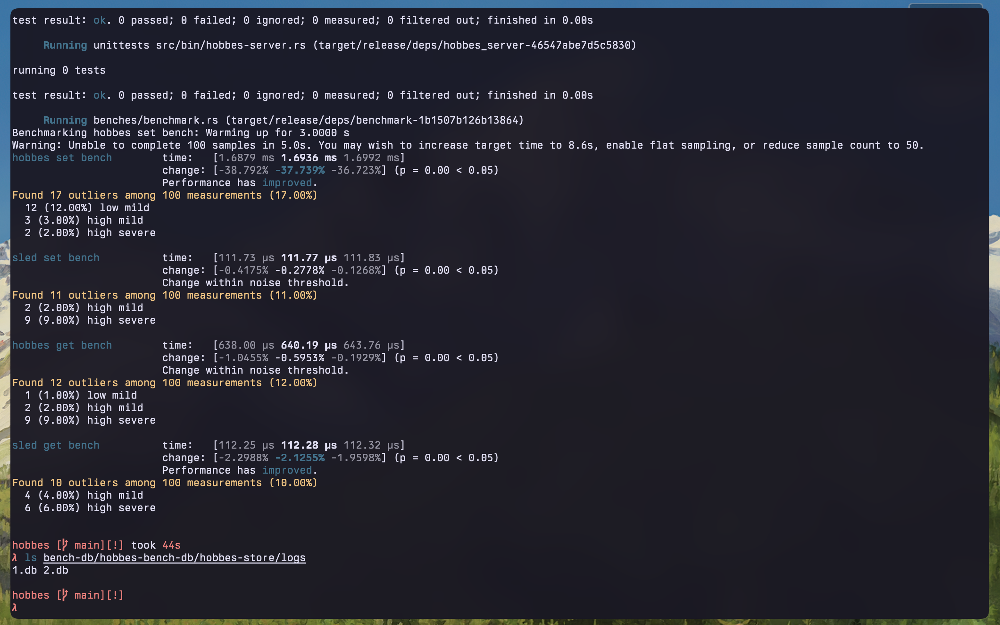
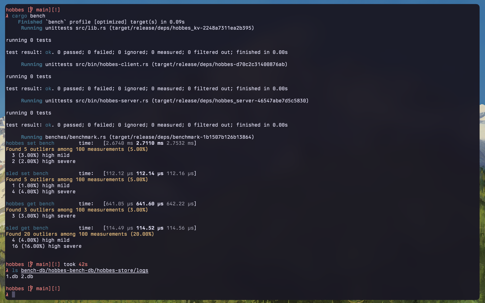
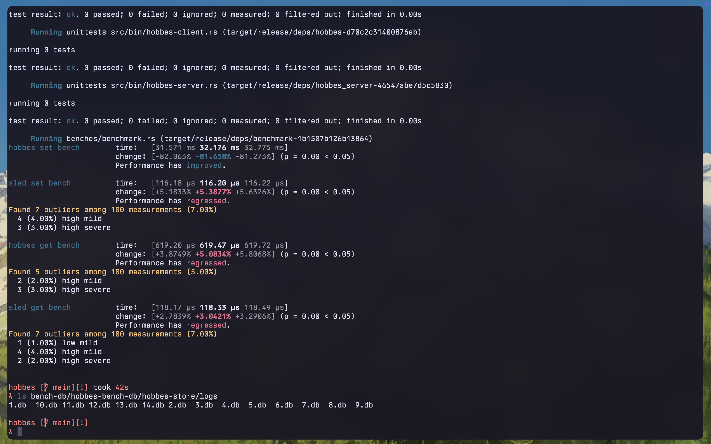

## Introduction

This blog is about Hobbes, a log structured key-value store that I’ve been working on, inspired by Bitcask and written in Rust.

Link to the [Github Repo](https://github.com/anirudhsudhir/hobbes)

I have been following the [PingCAP Talent Plan](https://github.com/pingcap/talent-plan/blob/master/courses/rust/README.md) guide. It breaks down the project into smaller building blocks and provides 5 sets of incremental tests. Highly recommended for learning about databases and Rust!

> I presented a talk on this project at the October 2024 Rust Bangalore Meetup at Couchbase! [[Images](/pow.html#october)][[Slides](/assets/slides/bitcask_rust_meetup_slides.pdf)]

<!-- ## What is Bitcask -->

[The Bitcask paper](https://riak.com/assets/slides/bitcask-intro.pdf)

<!-- > To be added -->

---

<!-- # Initial Implementation

> WIP -->

This blog is a devlog of the project which was built over several phases.

## 1. Project Init - Log-structured file I/O

### Serialization format

Hobbes persists the commands to the disk in a binary format. The [MessagePack](https://msgpack.org/) format was chosen for its impressive serialization and deserialization performance as well as compact binary representations, while remaining easy to use.

#### The KVStore struct

1. mem_index - An in-memory index mapping keys to a ValueMetadata struct, currently a HashTable
2. logs_dir - Path to the folder storing logs
3. log_writer - A write handle to the active log
4. log_readers - A collection of readers (HashMap<u64, BufReader<File>>) to access all logs

   - This approach avoids the file open overhead associated with repeated GET commands
   - A potential downside to this would be increased memory usage and OS limit on open file handles. Since the number of open files would not practically cross double digits, the extra memory usage is a useful tradeoff for fewer open and close operations.

5. current_log_id - The id of the active mutable log

#### The ValueMetadata struct

1. log_pointer - Offset to the start of the log command such as ‘SET x 5’
2. file_id - Name of the log containing the command

### Initialising the store

Determine if the store is a new or existing one
Obtain directory entries of the log folder using fs::read_dir()

- If entries present: Existing store

1. find the maximum value - use integers for log names such as 1.db and 2.db
2. Initialise all write and read handles
3. Replay logs to recreate the index

- For an empty store

1. Create 1.db and initialise the write handle

---

### Log Compaction

#### Need for compaction

The write-ahead log (WAL) appends new data to the log for every command. Older key-value pairs might be invalidated by newer entries or deletions. Log compaction is necessary to:

- Ensure efficient disk usage by removing stale entries
- Improve startup and recovery by reducing the number of entries to be replayed to rebuild the in-memory index.

Use a similar storage format as Bitcask - The storage directory will consist of a single mutable append-only log and several immutable read-only logs holding compacted records.

#### Procedure

Compaction is kicked off when a log size hits a certain threshold, such as 10kB. All writes are made to a new log while the current log is compacted.
(The store was single-threaded during the initial compaction implementation and did not require locks)

1. Update the log id and writer to a new file and add a reader to the log_readers collection
2. Replay the current logs and store the latest key-value pairs in a hashmap
3. Persist the key-value pairs in an updated log such as 5_compacted.db

   - Clone the existing index and insert or update entries

4. Update KVStore

- Rename x_compacted.db to x.db: This operation overwrites the stale log with the compacted log
- Replace the in-memory index
- Update the reader of the freshly compacted log

A potential problem with this compaction approach is that if a key update or delete command is appended to a newer log, the stale entry in the older log is not compacted.

---

## 2. Synchronous client-server networking

### Client-server architecture

<!-- Rewrite this -->

The key-value store is a server that listens for commands on the specified address. A tool such as netcat can be used instead of the hobbes client to send commands

```sh
echo "<length_of_cmd>\r\nSET\r\n<key>\r\n<val>\r\n" | nc <addr> <port>
echo "10\r\nGET\r\nfoo\r\n" | nc localhost 4000
echo "15\r\nSET\r\nfoo\r\nbar\r\n" | nc localhost 4000
echo "9\r\nRM\r\nfoo\r\n" | nc localhost 4000
```

The length of the command is prepended before being sent. For instance, "GET\r\nfoo\r\n" is 10 bytes long. "10\r\n" is prefixed to the command and sent.

The command and arguments are separated and terminated by a carriage return line feed (CRLF)("\r\n").

---

### Pluggable storage engines

<!-- Rewrite this -->

Hobbes offers pluggable storage backends. Currently, there are two choices:

- hobbes: The default engine with a Bitcask-like architecture, built from scratch
- sled: An alternate production engine with features such as ACID transactions ([Github](https://github.com/spacejam/sled))

---

## Multi-log compaction

<!-- Write about it -->

The earlier compaction algorithm compacted key-value pairs in a single log only. This meant that if the key was updated and the entry was written to a different log, the stale entry would not be garbage collected.

Multi-log compaction utilises the following approach. Firstly, a subdirectory is created for compacted logs. This leads to two different states of the DB:

   1. an active "logs/" directory that is used for reads and writes
   2. a "compacted-logs/" directory that stores the compacted logs

Instead of reading and replaying all the logs on disk, the index is used to obtain the latest key-value pairs since it holds the current state of the DB in Bitcask. Hobbes iterates and performs a GET for each key in the index. This involved refactoring the GET function to use a new helper:

```rust
   fn get_val_metadata(&mut self, key: String) -> Result<Option<(String, ValueMetadata)>>
```

This function is used by the GET function to retrieve the value associated with a key while the compaction manager uses it to obtain the value as well as the associated metadata for a key.

The keys and values are then flushed to new logs in the "compacted-logs/" directory along with a new field, the timestamp when the current entry was first written to the log. This is used to determine the newest entry across logs for a particular key while replaying the logs during DB initialisation.

The key along with its updated metadata is then inserted into the updated index.

Before writing each entry, the size of the active compacted log is checked. If it  equals or exceeds the maximum permitted log size, the current log is closed and a new log is created. Each log is named numerically in ascending order, such as "compacted-logs/1.db", "compacted-logs/2.db" and so on.

Once the compacted keys are flushed to disk and inserted into the updated index, the database state is updated. The existing readers and writers are removed, "compacted-logs/" is renamed to "logs/" (overwriting the older uncompacted logs) and the active log id and index is updated.

```rust
   self.log_readers = None;
   // Ignoring error as directory may not exist
   let _ = fs::remove_dir_all(&self.logs_dir);

   fs::rename(&hobbes_compacted_logs_path, &self.logs_dir).with_context(|| {
      format!(
            "[COMPACTION] Error while renaming {:?} to {:?}, Current logs dir -> {:?}",
            hobbes_compacted_logs_path, self.logs_dir, self.logs_dir
      )
   })?;

   self.mem_index = updated_index;
   self.current_log_id = current_compact_log_id + 1;
   self.log_writer = None;
```

Multi-log compaction involved an update to the HobbesEngine (previously KvStore) and ValueMetadata structs, to allow readers and writers to be replaced on compaction using initialisation functions.

```rust
/// HobbesEngine holds the in-memory index with keys and log pointers
/// #[derive(Debug)]
pub struct HobbesEngine {
    mem_index: HashMap<String, ValueMetadata>,
    // logs_dir holds the path to the directory containing active logs
    logs_dir: PathBuf,
    // db_dir holds the path to the directory used by the database,
    // including the active and compacted logs sub-directories
    db_dir: PathBuf,
    log_writer: Option<File>,
    log_readers: Option<HashMap<u64, BufReader<File>>>,
    current_log_id: u64,
}

#[derive(Debug, Clone)]
struct ValueMetadata {
    log_pointer: u64,
    log_id: u64,
    timestamp: DateTime<Local>,
}

fn log_readers_init(&mut self) -> Result<()>
fn log_writer_init(&mut self) -> Result<()>
```

---

### Benchmark Results

The benchmark for Hobbes was fixed, allowing for performance comparisons with sled. The benchmark involves storing 500 random keys of the form, "KEY_<rand_num> = VALUE_<rand_num>", such as "KEY_124 = VALUE_124". All the keys are then retrieved and checked.

First, SETs for Hobbes and sled are benched, followed by GETs, using [criterion](https://github.com/bheisler/criterion.rs).

Benchmark results for a 500 key set and 1 mb log size limit



Benchmark results for a 500 key set and 100 kb log size limit



Benchmark results for a 500 key set and 10 kb log size limit



Currently, the single-threaded Hobbes bitcask engine is much slower than sled.

---