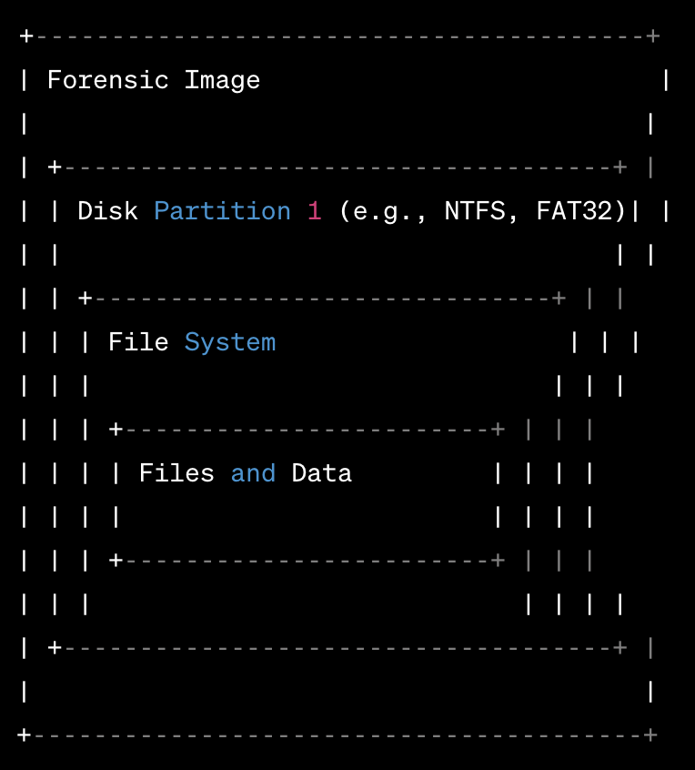
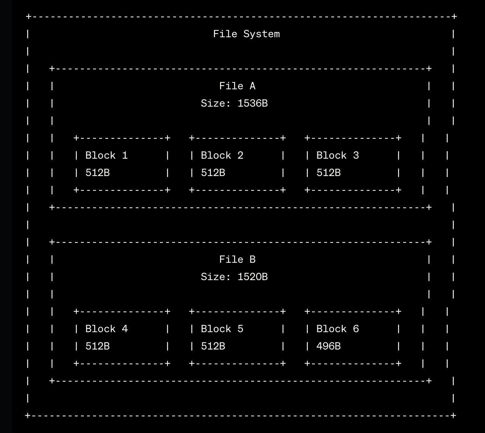
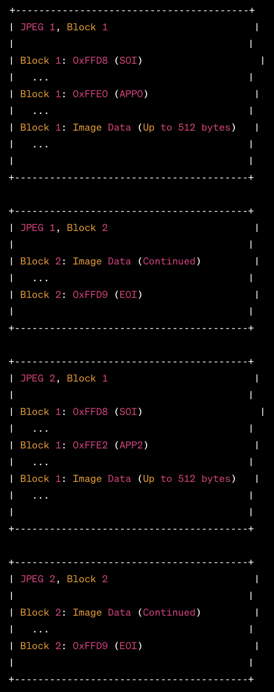

This post is part of a talk I gave at the Mentor Expo conducted by [HSP](https://homebrew.hsp-ec.xyz), the developer community at my college. I delivered the talk on 23rd November, 2023.

### About

qapture is a CLI tool to recover deleted JPEGs from a forensic image.

[Link to the repo](https://github.com/anirudhsudhir/qapture)

---

### Background

When a file is deleted, it is removed from the file tree structure. However, the individual bytes remain in memory until they are overwritten by the OS.

This implies that if all of the individual bytes are read from memory and pieced together in the right order and format, the file could be recovered in certain cases.

---

### What’s a forensic image?

Forensic images are exact copies or replicas of digital storage media, typically created for the purpose of preserving and analyzing digital evidence. There are several types of forensic images such as RAW images, dd (Disk Dump) images and EO1(Encase) images.

qapture uses the RAW image format since it contains a bit-by-bit copy of the entire storage medium. The metadata associated with the disk or the files are stored separately, simplifying recovery.



---

### How JPEGs are stored in memory

A JPEG file is divided into segments, each starting with a marker. Markers are two bytes long and start with 0xFF. Some markers define segments that contain specific information about the image, such as the image dimensions, color space information, and more.

Of these, the SOI(Start of image) along with the APPn(Application specific codes) and EOI(End of image) markers are the ones that denote the beginning and end of the JPEG file.

These markers are represented by various hexadecimal codes:

- SOI - 0xFF(255), 0xD8(216)
- APPn - 0xFF(255), 0xEn(224 to 239) (where n represents any hexadecimal digit)
- EOI - 0xFF(255), 0xD9(217)


---

### Block Size

Block size refers to the minimum amount of data that can be stored or retrieved at a time. When a file is created, the file system allocates space for it in terms of blocks. The file's data is then divided into chunks accordingly. Even if a particular block is not completely used, the next file is stored in the following one, with the remaining free space in the current block called slack space. Block sizes vary depending upon the filesystem. For example, the FAT filesystem usually utilizes 512 bytes per block.

Blocks are highly important as they drastically increase the speed of any file IO operation.



---

### How qapture works

qapture is a CLI tool.
The user runs it by passing the path to the RAW image as an argument.

```sh
./qapture PATH_TO_IMAGE.raw
```

qapture checks if a valid path is provided and prompts the user for the block size of the RAW image. It then reads **X** bytes of the image, where **X** corresponds to the block size, and stores it in an array.

It searches the block for a new JPEG by checking if:

- the first two bytes are 255(0xFF) and 216(0xD8) (indicating SOI)
- the third byte is 255 (0xFF) and the fourth is between 224 and 239 (0xEn) (indicating APPn)

If these conditions are satisfied, it writes the array to a new JPEG file in the binary format.

While writing the array to the file, qapture checks if the current and the following byte is 255(0xFF) and 217(0xD9) respectively (indicating EOI).

- If an EOI is encountered, the EOI marker is written and file is closed.
  qapture then reads the following block from the RAW image.

- If no EOI is encountered, qapture writes the entire array to the JPEG and reads the following block.

This process continues until all of the RAW image is read.



Once the entire image is read, qapture prints the number of JPEGs which have been successfully recovered.
These JPEGs are stored in an 'images' directory created by the application within the project directory.
